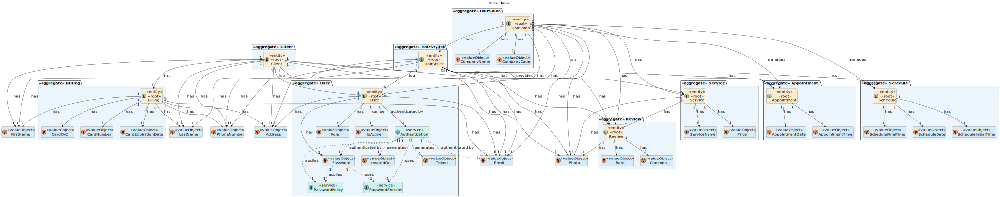

# Analysis

The construction process of the domain model is based on the client specifications, especially the nouns (for _concepts_) and verbs (for _relations_) used. 

## Rationale to identify domain conceptual classes ##
To identify domain conceptual classes, start by making a list of candidate conceptual classes inspired by the list of categories suggested in the book "Applying UML and Patterns: An Introduction to Object-Oriented Analysis and Design and Iterative Development". 

### _Conceptual Class Category List_ ###

**Business Transactions**

* Bussiness
* Offer

---

**Transaction Line Items**

* Products
* Services

---

**Product/Service related to a Transaction or Transaction Line Item**

* PublishedAnnouncement

---

**Transaction Records**

* log File

---

**Roles of People or Organizations**

* Unregistered User
* Client
* Hair Stylist
* Hair Salon
* SystemAdministrator

---

**Places**

* State
* District
* City
* Adderss

---

**Noteworty Events**

* HairCut events

---

**Physical Objects**

* Salon
* Hair Products

---

**Descriptions of Things**

* Photos
* Address
* TypeOfSalon
* Roles
* Bussiness

---

**Catalogs**

* HairStyle
* Salon
* PublishedAnnouncement
* AnnouncementRequest

---

**Containers**

*  Person

---

**Organizations**

* Salon

---

**Financial Instruments**

*  Bussiness

---

**Documents mentioned/used to perform some work/**

* Contacts
* User Information
---

###**Rationale to identify associations between conceptual classes**###

An association is a relationship between instances of objects that indicates a relevant connection and that is worth of remembering, or it is derivable from the List of Common Associations: 

+ **_A_** is physically or logically part of **_B_**
+ **_A_** is physically or logically contained in/on **_B_**
+ **_A_** is a description for **_B_**
+ **_A_** known/logged/recorded/reported/captured in **_B_**
+ **_A_** uses or manages or owns **_B_**
+ **_A_** is related with a transaction (item) of **_B_**
+ etc.

| **_Concept (A)_**          | **_Association_**                  |     **_Concept (B)_** |                                       
|:---------------------------|:-----------------------------------|----------------------:| 
| Address                    | has                                |                 State |
| Employee                   | accepts/declines                   |                 Offer |
| Salon                      | publishes                          |          Announcement |
| Salon                      | is an                              |    Group of Employees | 
| Agent                      | lists and responds to a \n +sender |               Message | 
| Agent                      | defines                            |             Comission |
| Agent                      | receives a \n +receiver            |               Message |            
| Agent                      | reviews                            |   AnnouncementRequest |                
| AnnouncementRequest        | has a                              |              Property |
| Salon                      | has                                |               Address |                             
| Salon                      | has                                |             Comission |                          
| Salon                      | has                                | PublishedAnnouncement |              
| Salon                      | has                                |   AnnouncementRequest |
| Client                     | addresses                          |                 Store |
| Client                     | has                                |               Address |
| Client                     | makes                              |                 Offer |
| Client                     | receives a \n +receiver            |               Message |
| Client                     | requests                           |              Service  |
| Client                     | has an                             |               Address |
| Client                     | is an                              |                Person |
| District                   | has                                |                  City |
| Employee                   | has a                              |                  Role |
| Employee                   | works in                           |                 Salon |
| Employee                   | belongs to                         |                Person |
| File                       | imported by                        |   SystemAdministrator |
| House                      | contains                           |           SunExposure |
| House                      | is a                               |             Residence |
| Person                     | can have                           |               Address |
| Person                     | has                                |              Contacts |
| Property                   | has                                |               Address |
| Property                   | has                                |                Photos |
| PublishedAnnouncement      | advertises                         |               Service |
| PublishedAnnouncement      | has                                |                 Salon |
| PublishedAnnouncement      | is a                               |   AnnouncementRequest |   
| PublishedAnnouncement      | can have a                         |           Description | 
| PublishedAnnouncement      | has                                |                 Price | 
| PublishedAnnouncementState | has                                | PublishedAnnouncement |
| State                      | has                                |              District |
| Salon                      | has                                |              Contacts |
| Salon                      | located at                         |               Address |
| SalonManager               | analyses                           | PublishedAnnouncement |
| SalonManager               | is an                              |              Employee |
| SalonManager               | analyses sold                      | PublishedAnnouncement |
| SalonManager               | intends to see                     |                 Offer |
| SystemAdministrator        | adds                               |                  City |
| SystemAdministrator        | adds                               |              District |
| SystemAdministrator        | adds                               |                 State |
| SystemAdministrator        | registers                          |                 Store |
| SystemAdministrator        | is an                              |              Employee |
| UnregisteredUseR           | can register as                    |                Client |
| UnregisteredUseR           | can register as                    |              Employee |

## Domain Model

**Do NOT forget to identify concepts atributes too.**

**Insert below the Domain Model Diagram in a SVG format**

